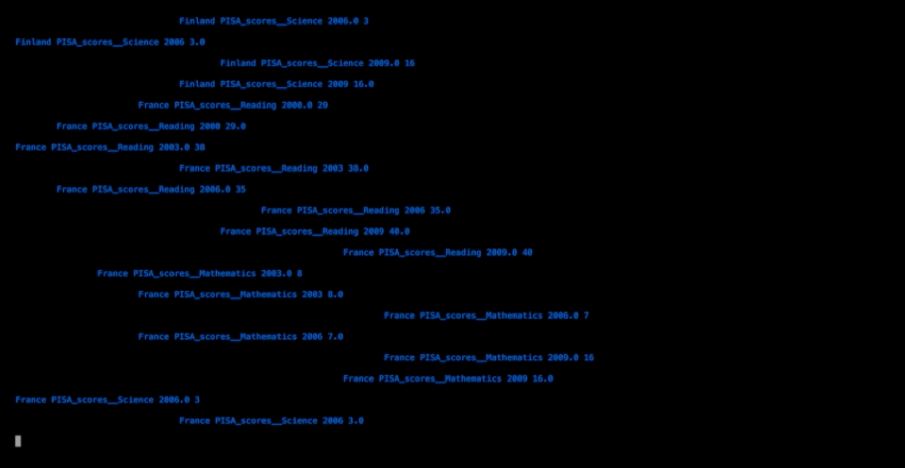

# Gender data sonification

Gender data sonification project.

*An insight into gender inequalities through data sonification*

>Gender data was collected and processed in order to reveal gender inequalities. For example, the absolute value of the difference of boys and girls scores in educational tests is used. The data is then encoding in distinctive elements of a musical piece, such as distorted instruments or random patterns. Bigger inequalities are then perceived as strongly altered audio. Data points are presented in the screen as they are used in the musical piece.

*Piece created for the opening of Woman of Mathematics exhibition at the Max Planck Institute for Mathematics in Bonn. November 10th, 2016.*

Music & Programming

* **[Alice Guerlot-Kourouklis](www.algk.fr)**
* **Jimena Royo-Letelier**

[website](http://www.algk.ovh/sonification/genderdata.html)

[video](https://vimeo.com/194002936)

## Configuration and dependencies

1) Install pyosc python package

* $ git clone https://github.com/ptone/pyosc.git
* $ cd pyosc
* $ sudo ./setup.py install

2) Set valid data_path 'path/to/sonification/data/oced' in data_processing.py file.

## Data source

[OECD gender data](http://www.oecd.org/gender/data/)

